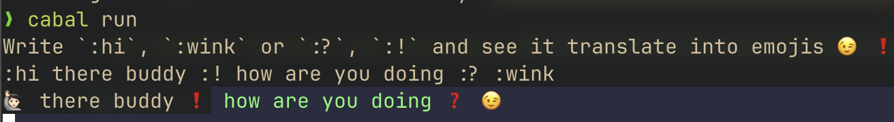

# Tmoji — convert text to emoji



## Install Haskell and Toolchains

```ps1
Set-ExecutionPolicy Bypass -Scope Process -Force;[System.Net.ServicePointManager]::SecurityProtocol = [System.Net.ServicePointManager]::SecurityProtocol -bor 3072; try { & ([ScriptBlock]::Create((Invoke-WebRequest https://www.haskell.org/ghcup/sh/bootstrap-haskell.ps1 -UseBasicParsing))) -Interactive -DisableCurl } catch { Write-Error $_ }
```

[How to install Haskell?](https://www.youtube.com/watch?v=bB4fmQiUYPw)

## Build & Run

```ps1
git clone https://github.com/TBytes404/Tmoji.git
cd Tmoji
cabal run
```
